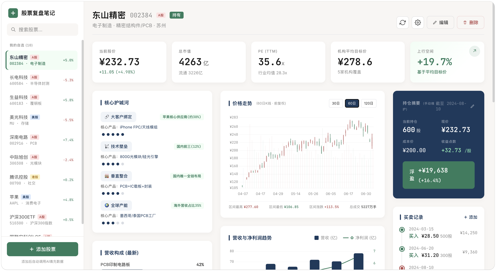
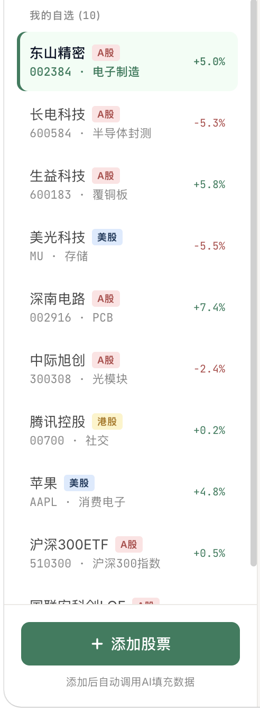
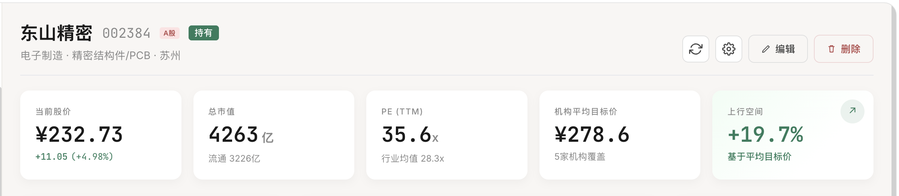
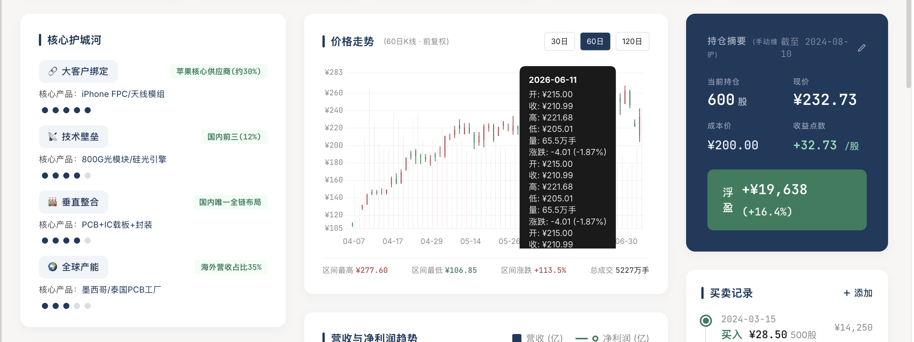
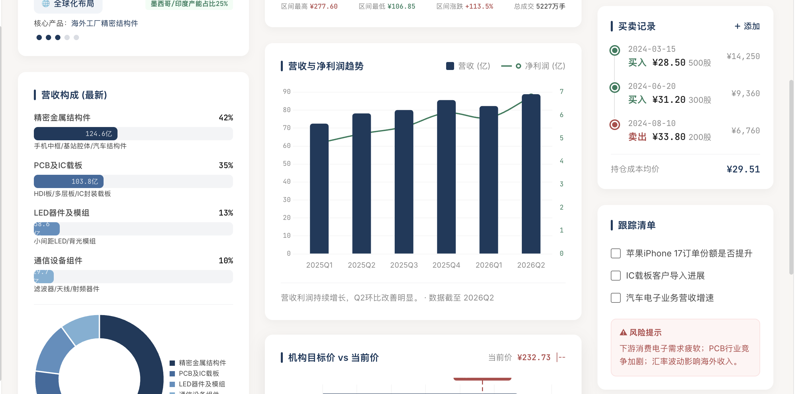
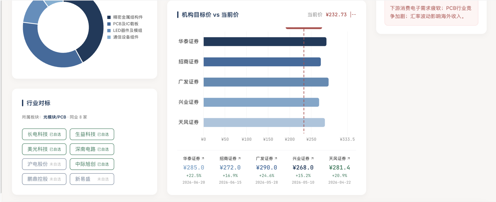
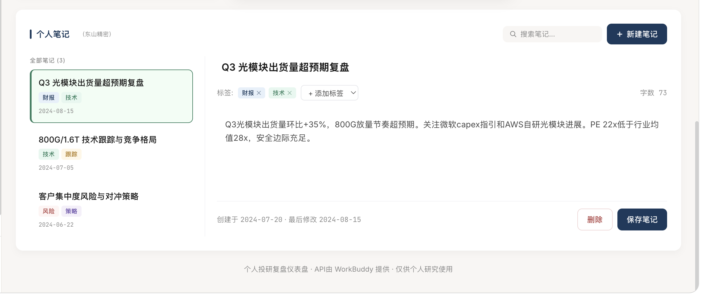
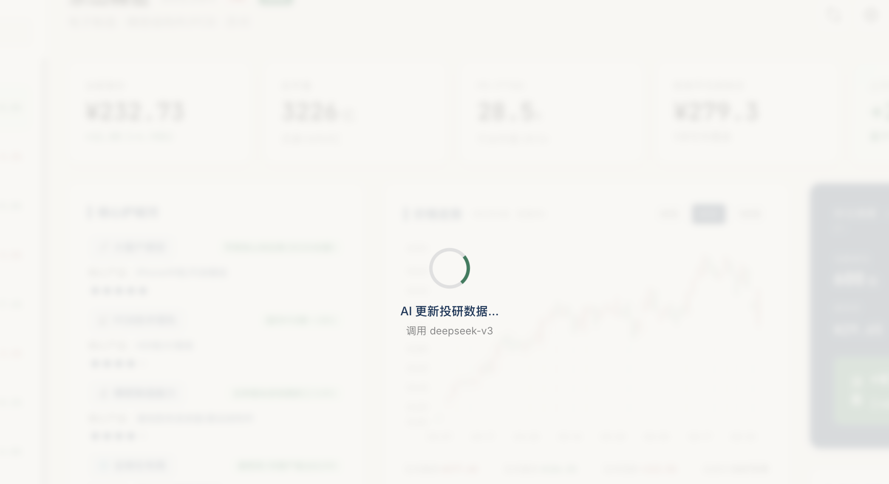

# 📊 WorkBuddy · 个人 AI 投研辅助工具

> 一个基于 WorkBuddy AI 的个人股票投研仪表盘，支持 A股/港股/美股/ETF/LOF 多市场实时行情、AI 智能分析、机构目标价、个人复盘笔记等一站式投研工作流。



---

## 🌟 核心功能 / Features

### 📈 实时行情（多市场支持）
- **A股**：通过腾讯 `qt.gtimg.cn` 接口获取实时价格、市值、PE、PB
- **港股**：支持 5 位代码（如 00700 腾讯、09988 阿里）
- **美股**：支持字母代码（如 AAPL、NVDA、MU）
- **ETF/LOF 基金**：自动识别基金类型，AI 精确查询前 10 大重仓股
- 自动货币单位转换：A 股 ¥ / 港股 HK$ / 美股 $

### 🤖 AI 智能投研分析
- **核心护城河**：AI 自动分析公司的客户绑定、技术壁垒、规模优势等，含具体产品+市场份额
- **营收构成**：饼图+条形图展示各业务占比，含具体产品描述
- **机构目标价**：5 家不同券商的真实目标价 + 平均值 + 上行空间百分比
- **同业对标**：AI 推荐 5-8 家真实同行公司，可点击切换
- **财报趋势**：6 个季度营收/净利润双轴图
- **风险提示**：AI 生成行业风险点 + 跟踪清单

### 📊 K 线价格走势
- 蜡烛图（红涨绿跌，符合中国习惯）
- 支持 30/60/120 日切换
- A 股走腾讯接口，美股/港股走 TwelveData（避免腾讯美股日 K 数据缺失问题）
- 区间最高/最低/涨跌/总成交统计

### 💼 持仓管理
- 持仓摘要：股数、成本、现价、浮盈金额与百分比
- 买卖记录时间线
- 内联编辑（点击编辑图标切换输入模式）

### 📝 个人复盘笔记
- 每只股票独立笔记系统（切换股票自动加载该股笔记）
- 富文本编辑 + 5 类彩色标签（财报/技术/风险/策略/跟踪）
- 笔记搜索 + 字数统计

### 💾 本地持久化
- 所有数据自动保存到 localStorage（含股票列表、笔记、持仓、设置）
- 关闭浏览器后再打开会恢复上次状态
- 支持数据导出/导入 JSON 备份

### ⌨️ 键盘快捷键
- `Ctrl+S`：保存笔记
- `Ctrl+N`：新建笔记
- `Ctrl+R`：刷新行情
- `Esc`：关闭模态框

---

## 🚀 快速开始 / Quick Start

### 环境要求
- [Node.js](https://nodejs.org/) 18+ （推荐 22.x）
- 现代浏览器（Chrome / Edge / Safari / Firefox）

### 步骤 1：克隆仓库

```bash
git clone https://github.com/<你的用户名>/<仓库名>.git
cd <仓库名>
```

### 步骤 2：配置你的 API Key

> ⚠️ **重要**：本仓库已移除所有内置 API Key，使用前必须填入你自己的 Key。

打开 `server.js`，找到这一行：

```javascript
const WB_API_KEY = process.env.WB_API_KEY || 'YOUR_API_KEY_HERE';
```

**两种方式填入 Key**：

**方式 A：直接修改代码**（适合本地使用）
```javascript
const WB_API_KEY = process.env.WB_API_KEY || 'ck_你的真实API_Key';
```

**方式 B：通过环境变量**（推荐，更安全）
```bash
export WB_API_KEY="ck_你的真实API_Key"
node server.js
```

**获取 API Key**：
1. 访问 [CodeBuddy 官网](https://codebuddy.cn)
2. 注册并登录
3. 进入「设置 → API Keys」
4. 创建新的 API Key（格式：`ck_xxxxxxxx`）

### 步骤 3：启动本地代理服务器

```bash
node server.js
```

启动成功后会看到：

```
═══════════════════════════════════════════════
  股票复盘笔记 - 本地代理服务器已启动
═══════════════════════════════════════════════
  浏览器打开: http://localhost:18927
  AI代理:    /api/chat → https://copilot.tencent.com/v2/chat/completions
═══════════════════════════════════════════════
  按 Ctrl+C 停止
```

### 步骤 4：浏览器访问

打开浏览器访问 **http://localhost:18927**（不是 18924/18926 等其他端口）

⚠️ **不要直接双击 `index.html` 用 `file://` 协议打开**，否则：
- AI 调用会被浏览器 CORS 拦截
- 行情接口在 `file://` 协议下行为异常

---

## ⚙️ 配置说明 / Configuration

### AI 模型设置

在网页右上角点击 ⚙️ 齿轮图标打开设置面板：

| 配置项 | 说明 | 默认值 |
|---|---|---|
| API URL | AI 接口地址 | `http://localhost:18927/api/chat`（本地代理） |
| API Key | 你的 API Key | 空（前端不需要，代理会注入） |
| Model | 模型名称 | `deepseek-v3` |
| 行情源 | `auto`/`simulate` | `auto` |
| 自动更新 | 开关 + 间隔 | 关闭 / 5 分钟 |

**支持的模型**（OpenAI 兼容接口）：
- `deepseek-v3`（默认，性价比高）
- `gpt-4o`
- `claude-3.5-sonnet`
- 其他 OpenAI 兼容模型

### 数据源说明

| 数据 | A 股 | 港股 | 美股 |
|---|---|---|---|
| 实时行情 | 腾讯 `qt.gtimg.cn` | 腾讯 `qt.gtimg.cn` | 腾讯 `qt.gtimg.cn` |
| K 线 | 腾讯 `web.ifzq.gtimg.cn` | TwelveData | TwelveData |
| 投研数据 | WorkBuddy AI | WorkBuddy AI | WorkBuddy AI |

---

## 📁 项目结构 / Project Structure

```
.
├── index.html          # 主应用（单文件 SPA，含全部 HTML/CSS/JS）
├── server.js           # 本地代理服务器（解决 CORS + 静态文件服务）
├── mockups/            # 8 张界面设计稿
│   ├── 01-整体仪表盘概览.png
│   ├── 02-添加股票面板.png
│   ├── 03-核心数据卡片.png
│   ├── 04-护城河与K线持仓.png
│   ├── 05-营收饼图与跟踪清单.png
│   ├── 06-行业对标与目标机构价.png
│   ├── 07-个人复盘笔记编辑.png
│   └── 08-数据刷新状态.png
├── .gitignore
└── README.md
```

---

## 🎯 使用指南 / Usage Guide

### 添加新股票

1. 点击左侧"添加股票"按钮
2. 填入公司名称、代码、市场（A/HK/US）、价格、股数
3. 点击"添加并 AI 填充"
4. 系统会：
   - 自动获取实时行情
   - 调用 AI 生成 subtitle（如"光模块 · 数据中心 · 苏州"）
   - AI 生成 5 家机构目标价
   - AI 生成护城河、营收构成、同业对标等
   - 如果是基金，AI 精确查询前 10 大重仓股

### 切换股票

点击左侧股票列表中的任意股票，主区会切换到该股票的全部数据。

### 刷新数据

点击右上角刷新按钮，会依次：
1. 拉取所有股票的实时行情
2. 调用 AI 重新生成当前股票的投研数据

### 编辑笔记

1. 在底部"个人笔记"区点击"新建笔记"
2. 输入标题、选择标签、编写内容
3. 自动保存到 localStorage

---

## 🔧 常见问题 / FAQ

### Q: 启动后页面打不开？
A: 确认 `node server.js` 正在运行，且端口 18927 没有被占用。如被占用可修改 `server.js` 中的 `PORT` 常量。

### Q: AI 数据填充失败，Toast 提示"请确保 server.js 代理已启动"？
A: 检查：
1. `server.js` 是否正在运行
2. `server.js` 中的 `WB_API_KEY` 是否已替换为你的真实 Key
3. 浏览器访问的是 `http://localhost:18927` 而非 `file://`

### Q: 美股 K 线显示"暂无 K 线数据"？
A: TwelveData 免费 demo key 有每日 800 次限额，超限会返回 401。可：
- 等待限额重置（次日 0 点 UTC）
- 在 [TwelveData](https://twelvedata.com/) 注册免费 key，替换 `index.html` 中的 `apikey=demo`

### Q: 机构目标价显示"目标价过期，请刷新"？
A: 预填的目标价是旧价时代的数据，系统会自动检测（偏离当前价 > 50% 视为过期）。点击刷新按钮，AI 会基于当前实时价重新生成合理目标价。

### Q: 总市值/流通市值显示为"---"？
A: 腾讯接口对该股票未返回市值字段（罕见情况），可手动在设置中填写。

---

## 🛠️ 技术栈 / Tech Stack

- **前端**：原生 HTML + CSS + JavaScript（无框架，单文件 SPA）
- **图表**：[Chart.js 4.4.1](https://www.chartjs.org/)（蜡烛图用 floating bar 模拟）
- **样式**：[Tailwind CSS](https://tailwindcss.com/)（CDN）
- **字体**：Inter + JetBrains Mono
- **AI**：WorkBuddy（OpenAI 兼容接口，deepseek-v3 模型）
- **行情**：腾讯 `qt.gtimg.cn` / `web.ifzq.gtimg.cn`
- **K 线**：腾讯 / [TwelveData](https://twelvedata.com/)
- **存储**：localStorage（无需后端数据库）
- **代理**：Node.js 原生 `http` + `https` 模块

---

## 📸 界面预览 / Screenshots

| 模块 | 预览 |
|---|---|
| 整体仪表盘 |  |
| 添加股票 |  |
| 核心数据 |  |
| 护城河+K线+持仓 |  |
| 营收饼图+跟踪清单 |  |
| 行业对标+机构目标价 |  |
| 个人笔记 |  |
| 数据刷新 |  |

---

## ⚠️ 免责声明 / Disclaimer

本工具仅用于个人学习和研究目的，不构成任何投资建议。股票投资有风险，数据可能存在延迟或错误，请以官方交易所数据为准。使用者需自行承担使用本工具产生的一切后果。

---

## 📄 License

MIT License - 详见 [LICENSE](LICENSE) 文件

---

## 🙏 致谢 / Acknowledgments

- [WorkBuddy](https://codebuddy.cn) - AI 推理服务
- [腾讯财经](https://gu.qq.com/) - 实时行情数据
- [TwelveData](https://twelvedata.com/) - 美股/港股 K 线数据
- [Chart.js](https://www.chartjs.org/) - 图表库
- [Tailwind CSS](https://tailwindcss.com/) - CSS 框架
